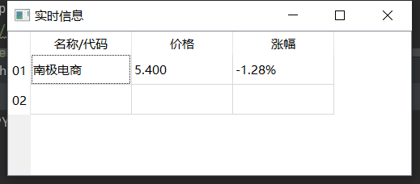

# miniStock
pyqt5 实现迷你盯盘

## 想做一个桌面盯盘小工具

初步预想的样子

## 需要实现的功能  
1、可以添加股票进行实时显示  
2、可以显示颜色  
3、可以设置透明度  
4、可以调整大小  
5、支持老板键  

最重要的是双击可用！   
其他功能不打算支持。要的就是mini 大而全请使用其他工具！ 

## 说明：
数据源来源是 新浪的  

使用的工具就是 pyqt5  
python 3.7
qt  
requests  
re  

## 使用  
1、安装依赖  
2、运行 start.py  

# 其他
本项目属于业余爱好，向做个这玩意去学习 pyqt5 
不一定有时间维护！